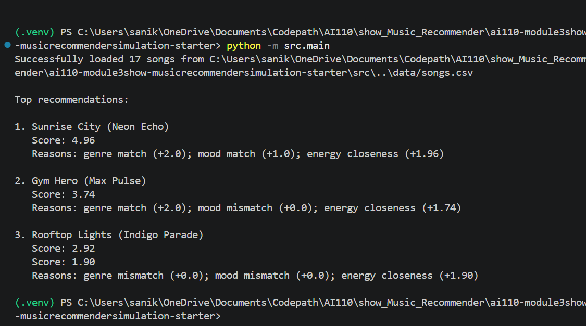
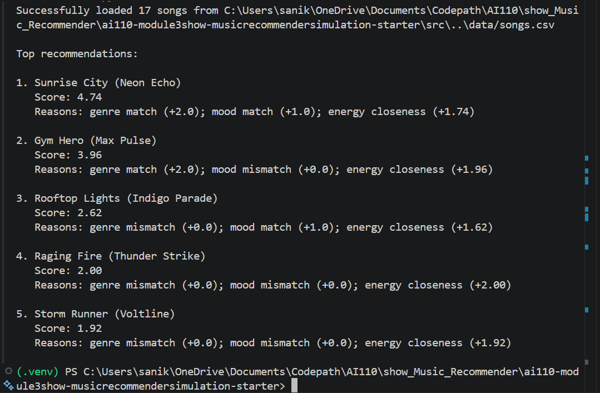
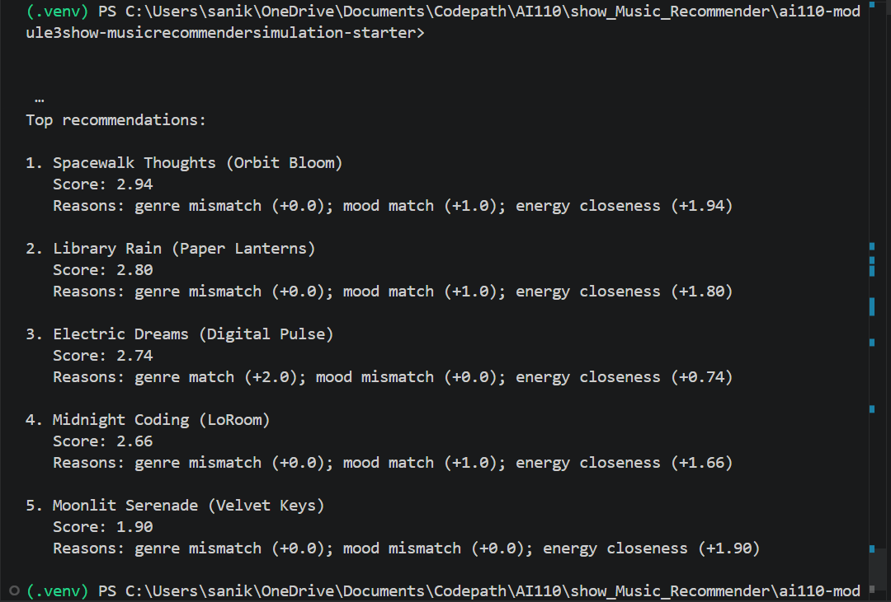
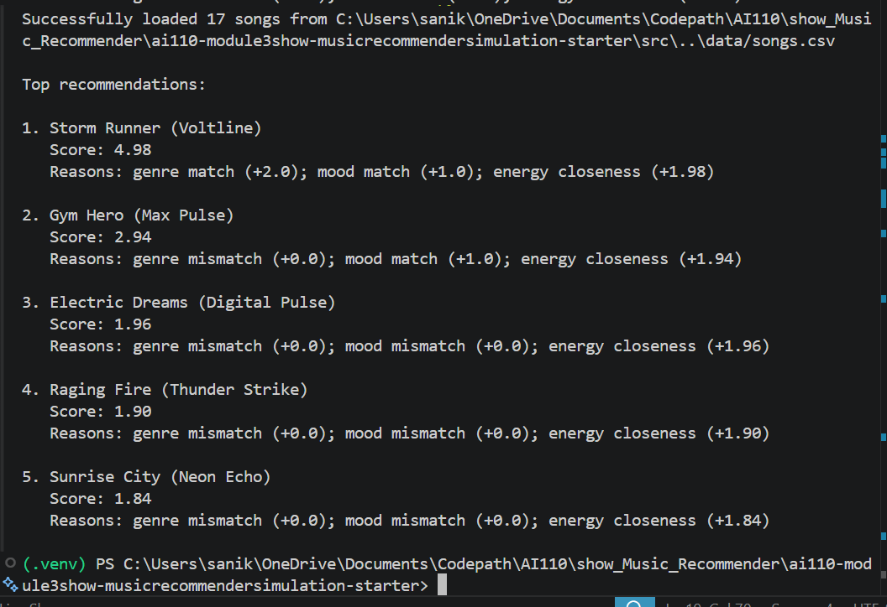
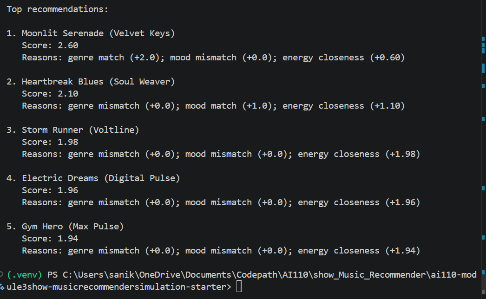

# 🎵 Music Recommender Simulation

## Project Summary

This project builds a small music recommender that picks songs from a limited catalog based on a user’s taste. It uses a user profile with genre, mood, and energy preferences to rank songs and recommend the best matches.

---

## How The System Works


- What features does each `Song` use in your system

  In this system, these numerical features are used: energy, tempo_bpm, valence, daceability, acousticness. These categorical features are used: genre, mood.


- What information does your `UserProfile` store

The user profile stores the preferred values for each numerical feature and the preferred categories for the categorical fetaures.


- How does your `Recommender` compute a score for each song

The recommender calculates a similarity score for each song based on how closely it matches the user's profile. First, for each numerical feature a similarity score is computed using this formula: 1 - |song_value - user_preference|. score = 1 means perfect match. Second, for categorical features, a score of 0 or 1 is given depending on whether it is a match or not. Third, all of these are calculated into one score as the average across features (with optional weighting for importance). Finally, a final score is provided that is to be used by the system.


- How do you choose which songs to recommend

First, compute scores for all songs in the dataset. Then, rank them by overall score and recommend the top N songs (e.g., top 3-5), excluding any already liked by the user. If ties occur, break them by secondary criteria like genre diversity.

- Algorithm Recipe

This recommender works like a matchmaker: it compares what you like with each song and gives it a score. Higher scoring songs get recommended first.

**The scoring system uses three signals, in order of importance:**

1. **Genre (Most Important - +2.0 points):** If a song matches your favorite genre, it gets +2.0 points. Otherwise, it gets 0. This is the biggest factor—the system strongly prefers your favorite genre. For example, if you like pop, a pop song starts with an advantage; a rock song starts at zero.

2. **Mood (Important - +1.0 point):** If a song matches your favorite mood (like "happy," "chill," or "intense"), it gets +1.0 point. Otherwise, it gets 0. This reinforces songs that match the emotional vibe you're looking for.

3. **Energy (Flexible - up to +2.0 points):** Energy measures how much intensity or excitement a song has. The system doesn't say "high energy is always good" or "low energy is always good." Instead, it rewards songs that match *your preferred energy level* closely. A perfect energy match gets +2.0 points; songs further away get fewer points. For example, if you like moderate energy (0.80), a song with energy 0.82 scores nearly +2.0, while a song with energy 0.30 gets much less.

**How it works in practice:** The system adds up all three scores for each song. Songs are then ranked from highest to lowest score, and the top songs are recommended to you (unless you've already liked them).

**Example:** If you prefer pop music with a happy mood and moderate energy (0.80), then:
- "Sunrise City" (pop, happy, energy 0.82) scores: 2.0 + 1.0 + 1.96 = 4.96 ✓ Top recommendation
- "Storm Runner" (rock, intense, energy 0.91) scores: 0.0 + 0.0 + 1.78 = 1.78 ✗ Much lower

The weighted approach prioritizes finding songs in your favorite genre and mood, while also considering energy to add variety.

---

## 3. How It Works (Short Explanation)

The system scores each song by checking how well it matches the user's preferred genre, mood, and energy. Songs get points for exact matches in genre and mood, plus bonus points for energy closeness. The top-scoring songs are recommended.

## Getting Started

### Setup

1. Create a virtual environment (optional but recommended):

   ```bash
   python -m venv .venv
   source .venv/bin/activate      # Mac or Linux
   .venv\Scripts\activate         # Windows

2. Install dependencies

```bash
pip install -r requirements.txt
```

3. Run the app:

```bash
python -m src.main
```


### Running Tests

Run the starter tests with:

```bash
pytest
```

You can add more tests in `tests/test_recommender.py`.

---

## Sample Recommendation Output

When you run the default profile (`genre=pop`, `mood=happy`, `energy=0.8`), the terminal should show the top-ranked songs with score and reasons. For example:

```text
Successfully loaded 17 songs from data/songs.csv

Top recommendations:

1. Sunrise City (Neon Echo)
   Score: 4.96
   Reasons: genre match (+2.0); mood match (+1.0); energy closeness (+1.96)

2. Gym Hero (Max Pulse)
   Score: 3.74
   Reasons: genre match (+2.0); mood mismatch (+0.0); energy closeness (+1.74)

3. Rooftop Lights (Indigo Parade)
   Score: 2.92
   Reasons: genre mismatch (+0.0); mood match (+1.0); energy closeness (+1.92)
```

This output confirms the `pop/happy` profile is favoring songs with matching genre and mood first, then energy closeness.

Here is a screenshot from one run:


---
The script runs a single profile by default. To evaluate multiple profiles manually, change the `user_prefs` dictionary in `src/main.py` and run the command again.

Suggested profiles and example runs:

- **High-Energy Pop**: `{"genre": "pop", "mood": "happy", "energy": 0.95}`
- **Chill Lofi**: `{"genre": "electronic", "mood": "chill", "energy": 0.25}`
- **Deep Intense Rock**: `{"genre": "rock", "mood": "intense", "energy": 0.90}`
- **Conflict Profile**: `{"genre": "classical", "mood": "sad", "energy": 0.90}`








---

## Experiments You Tried

We tested several user profiles and one weight change experiment.

- Switched the default profile from medium energy pop/happy to a high-energy pop profile.
- Tested a Chill Lofi profile and saw low energy, chill mood songs rise to the top.
- Tested a Deep Intense Rock profile and saw a strong genre+mood match win.
- Tested a Conflict Profile and saw the system choose the right genre even when mood and energy did not match.
- Changed energy weight and observed the model move from genre/mood focus to energy focus.

---

## Limitations and Risks

This recommender is simple and biased by the small dataset.

- It only has 17 songs, so many tastes are missing.
- Pop and lofi are overrepresented, so those styles show up more often.
- The current score math can favor genre too much or energy too much when weights change.
- It does not understand lyrics, artist style, or real listener context.


---

## Reflection

I learned that recommenders are really just weighted guesses based on how a song matches a user profile. In this project, the model added up genre, mood, and energy scores to decide which songs felt right, and changing those weights could make the top results look very different.

I also saw how bias can appear when one signal is stronger than the others. For example, the system sometimes preferred a pop song with the wrong mood because genre match was counted first, and it also favored the small number of pop/lofi tracks in the catalog. That means the model can be unfair to users with less common tastes or contradictory preferences.

---

## 7. `model_card_template.md` -- find my version in model_card.md

Combines reflection and model card framing from the Module 3 guidance. :contentReference[oaicite:2]{index=2}  

```markdown
# 🎧 Model Card - Music Recommender Simulation

## 1. Model Name

Give your recommender a name, for example:

> VibeFinder 1.0

---

## 2. Intended Use

- What is this system trying to do
- Who is it for

Example:

> This model suggests 3 to 5 songs from a small catalog based on a user's preferred genre, mood, and energy level. It is for classroom exploration only, not for real users.

---

## 3. How It Works (Short Explanation)

Describe your scoring logic in plain language.

- What features of each song does it consider
- What information about the user does it use
- How does it turn those into a number

Try to avoid code in this section, treat it like an explanation to a non programmer.

---

## 4. Data

Describe your dataset.

- How many songs are in `data/songs.csv`
- Did you add or remove any songs
- What kinds of genres or moods are represented
- Whose taste does this data mostly reflect

---

## 5. Strengths

Where does your recommender work well

You can think about:
- Situations where the top results "felt right"
- Particular user profiles it served well
- Simplicity or transparency benefits

---

## 6. Limitations and Bias

Where does your recommender struggle

Some prompts:
- Does it ignore some genres or moods
- Does it treat all users as if they have the same taste shape
- Is it biased toward high energy or one genre by default
- How could this be unfair if used in a real product

---

## 7. Evaluation

How did you check your system

Examples:
- You tried multiple user profiles and wrote down whether the results matched your expectations
- You compared your simulation to what a real app like Spotify or YouTube tends to recommend
- You wrote tests for your scoring logic

You do not need a numeric metric, but if you used one, explain what it measures.

---

## 8. Future Work

If you had more time, how would you improve this recommender

Examples:

- Add support for multiple users and "group vibe" recommendations
- Balance diversity of songs instead of always picking the closest match
- Use more features, like tempo ranges or lyric themes

---

## 9. Personal Reflection

A few sentences about what you learned:

- What surprised you about how your system behaved
- How did building this change how you think about real music recommenders
- Where do you think human judgment still matters, even if the model seems "smart"

